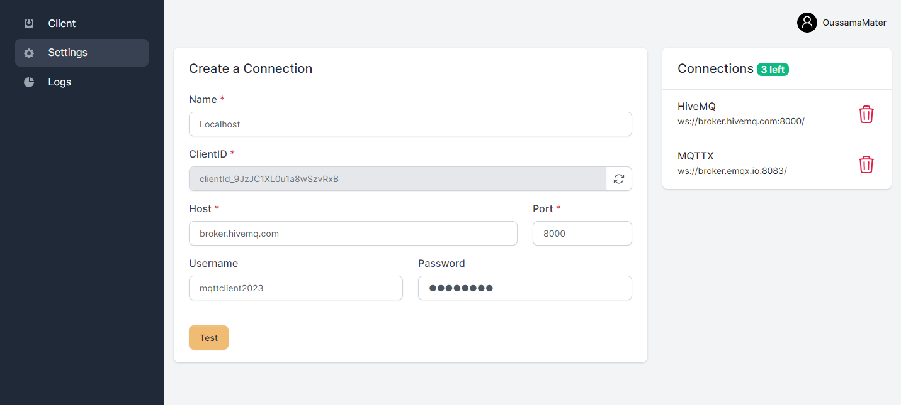

# Project Setup Guide

## Overview
An MQTT Client built with [Laravel](https://laravel.com/), [Livewire](https://laravel-livewire.com/) and [WebSockets](https://en.wikipedia.org/wiki/WebSocket), providing a set of features:

- A full-featured login system (login, register, email verification, profile update, and password reset).
- The ability to create, manage and use multiple connections to different brokers (public/private).
- The ability to subscribe and manage different topics on each connection with real-time updates.
- Logs that display all the received payloads and the ability to search, filter, and delete them.



## Manual Setup
> You can avoid this configurational step by using the [Docker installation process](#docker-setup).

Before setting up the project, make sure you have the required dependencies:
- **PHP >= 8.0**
- **composer**
- **npm**
- **MySQL**
- **MailHog**

### Installing Dependencies
>The following example works for Debian Based Linux Distributions.

Update the system
```bash
sudo apt update && sudo apt upgrade -y
```

Install PHP
```bash
sudo apt get install -y php8.1-cli php8.1-common php8.1-mysql php8.1-zip php8.1-gd php8.1-mbstring php8.1-curl php8.1-xml php8.1-bcmath
```

Install composer
```bash
curl -sS https://getcomposer.org/installer -o /tmp/composer-setup.php

sudo php /tmp/composer-setup.php --install-dir=/usr/local/bin --filename=composer
```

Install npm
```bash
sudo apt install nodejs npm
```

Install MySQL
```bash
sudo apt install mysql-server
```

Install MailHog
```bash
sudo apt-get -y install golang-go
go install github.com/mailhog/MailHog@latest
```

### Setting the project
Make sure you are in the `src` directory
```bash
cd src/
```

Install composer dependencies
```bash
composer install
```

Install npm dependencies and build the assets
```bash
npm install
npm run build
```

Create the `.env` file and generate the application encryption key
```bash
cp .env.example .env
php artisan key:generate
```

Update the `.env` file with your `mysql` credentials and `MailHog` host
```bash
DB_CONNECTION=mysql
DB_HOST=127.0.0.1 # old value: mysql
DB_PORT=3306
DB_DATABASE=# your database
DB_USERNAME=# your username
DB_PASSWORD=# your password

MAIL_HOST=127.0.0.1 # old value: mailhog
```

Update the `package.json` file by swapping the `scripts` section with the one below
```json
"scripts": {
    "dev": "vite",
    "build": "vite build"
},
```

Create the database schema and its tables by running the migrations
```bash
php artisan migrate
```

### Running the project

Start MySQL server
```
sudo systemctl start mysql
```

Start MailHog
```
~/go/bin/MailHog
```

Start the built-in web server
```bash
php artisan serve
```

You can now access the server at [http://localhost:8000](http://localhost:8000).


## Docker Setup
>Make sure Docker is installed.

>The `.env.example` you copied is already configured to be used with Docker, please don't change the configuration.

>If you are using a Windows 10/11, you need to know that Windows uses WSL (Windows Subsystem for Linux), which is a layer between Windows and Linux, this makes Docker slow and browser requests may take 30-60 seconds to be completed.

Spin up the containers
```bash
docker-compose up -d --build app
```

Running the command will expose 4 services with the following ports:
- **Nginx** - `:80`
- **MySQL** - `:3306`
- **PHP** - `:9000`
- **MailHog** - `:8025` 

Install composer dependencies
```bash
docker-compose run --rm composer install
```

Install npm dependencies and build the assets
```bash
docker-compose run --rm npm install
docker-compose run --rm --service-ports npm run build
```

Create the `.env` file and generate the application encryption key
```bash
cp .env.example .env
docker-compose run --rm php artisan key:generate
```

Create the database schema and its tables by running the migrations
```bash
docker-compose run --rm artisan migrate
```

You can now access the server at [http://localhost](http://localhost).